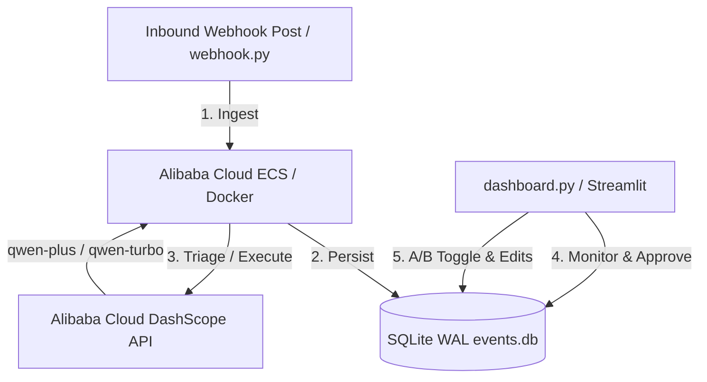

# Alibaba Cloud Services & APIs Integration

This project is fully powered by **Alibaba Cloud's DashScope (Model Studio)** infrastructure, using state-of-the-art Qwen LLMs for parallel triage, structured tool calling, and automated execution.

---

## 1. Alibaba Cloud API Integrations

The autopilot agent integrates with Alibaba Cloud APIs in the following code locations:

### 🤖 Triage Engine ([triage.py](file:///c:/Users/mouad/Downloads/qwen-hackathon-test/triage.py))
*   **Alibaba Cloud DashScope Endpoint:** Initialized using the official internationally compatible base URL:
    ```python
    client = OpenAI(
        api_key=API_KEY,
        base_url="https://dashscope-intl.aliyuncs.com/compatible-mode/v1",
    )
    ```
*   **Primary Model (`qwen-plus`):** Utilized for high-precision, multi-lingual function calling, emotional triage, and A/B draft variant generation.
*   **Fallback Model (`qwen-turbo`):** Dynamically triggered during outages or token limit exhaustion via our fallback recovery mechanism.
*   **Structured Tool-Calling:** Leverages Alibaba Cloud Model Studio's tool-calling capability to route requests natively without regex parser hacks.

### 📤 Automated Executor ([executor.py](file:///c:/Users/mouad/Downloads/qwen-hackathon-test/executor.py))
*   **CRM Tagging Tool:** Uses DashScope APIs to automatically categorize finalized customer support transcripts (`tag_for_crm`).
*   **Personalization Engine:** Coordinates DashScope to formulate localized, personalized replies after dynamically fetching shipping tracking details.

---

## 2. Alibaba Cloud Infrastructure Deployment Architecture

The application is architected for simple, production-ready containerized deployment on **Alibaba Cloud ECS (Elastic Compute Service)**.

### System Diagram



### ECS Deployment Guide

To deploy the Social Inbox Autopilot backend and Streamlit dashboard on an **Alibaba Cloud ECS Instance**:

1.  **Provision ECS Instance:**
    *   Create an ECS instance running Ubuntu 22.04 LTS (minimum 2 vCPUs, 4GB RAM is recommended).
    *   Configure Security Group Rules to open ports:
        *   `8501` (Streamlit Dashboard UI)
        *   `8001` (FastAPI Webhook ingestion API)

2.  **Server Initialization:**
    ```bash
    # Update system packages
    sudo apt update && sudo apt upgrade -y

    # Install Python 3.10+ and pip
    sudo apt install python3-pip python3-venv git -y
    ```

3.  **Clone & Configure:**
    ```bash
    # Clone repository
    git clone <your-github-repo-url>
    cd qwen-hackathon-test

    # Create virtual environment
    python3 -m venv venv
    source venv/bin/activate

    # Install requirements
    pip install -r requirements.txt
    ```

4.  **Setup Secrets:**
    ```bash
    cp .env.example .env
    nano .env
    # Add your DASHSCOPE_API_KEY from Alibaba Cloud console
    ```

5.  **Run Services (using systemd or screen):**
    ```bash
    # Start Webhook Server (Ingestion)
    nohup uvicorn webhook:app --host 0.0.0.0 --port 8001 > webhook.log 2>&1 &

    # Start Streamlit Dashboard UI (Human-in-the-loop portal)
    nohup streamlit run dashboard.py --server.port 8501 --server.address 0.0.0.0 > dashboard.log 2>&1 &
    ```
