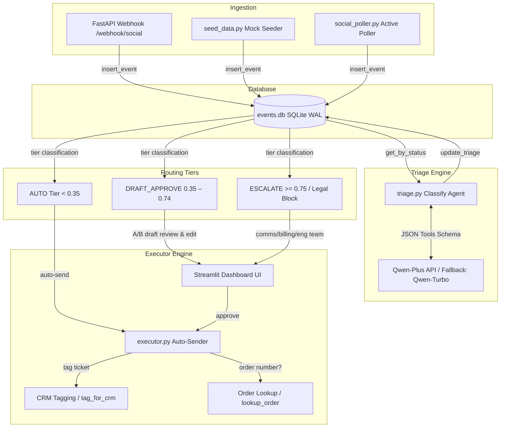

# 🔂 LoopBack — AI Social Inbox Autopilot


> **Track 4 — Autopilot Agent | Qwen Cloud Global AI Hackathon**

An end-to-end agentic system that manages inbound social media engagement — comments, DMs, mentions, and reviews — across platforms. It classifies every message, decides how much autonomy it has, executes low-risk actions autonomously, and routes critical decisions through a human approval checkpoint before anything public or irreversible happens.

---

## Architecture



**Event lifecycle state machine:**
```
pending_triage → auto_handled → sent
              → awaiting_approval → approved → sent
                                 → rejected
              → escalated
              → triage_failed
```

---

## Features

| Feature | Description |
|---|---|
| **Qwen function-calling** | Forced schema output — safe to route programmatically, no JSON hacks |
| **3-tier routing** | AUTO / DRAFT+APPROVE / ESCALATE with calibrated risk scores |
| **Multi-language** | Detects language, replies in the customer's own language |
| **Author memory** | Injects up to 3 prior messages from the same author into triage context |
| **Urgency scoring** | low / medium / high / critical independent of risk score |
| **Retry + fallback** | 3 attempts, exponential backoff, qwen-plus → qwen-turbo fallback |
| **SLA tracking** | 2h SLA for draft_approve, 1h for escalated; overdue badges in dashboard |
| **Order lookup tool** | 2-step tool chain: model calls lookup_order → generates personalized reply |
| **CRM tagging tool** | After every send, model classifies the interaction for CRM logging |
| **Brand crisis detector** | Detects escalation spikes (3+ in 10 min), logs + shows alert banner |
| **FastAPI webhook** | Real-time ingestion endpoint with HMAC auth + rate limiting |
| **Immutable audit log** | Every state transition recorded with actor, timestamp, and note |
| **Analytics dashboard** | 6 charts: tier/intent/platform/language/status/model; brand health score |
| **WAL SQLite** | Safe concurrent access from 2+ processes (webhook + dashboard) |

---

## Tech Stack

| Layer | Choice |
|---|---|
| LLM | Qwen Cloud (`qwen-plus` primary, `qwen-turbo` fallback) |
| API format | OpenAI-compatible SDK → DashScope endpoint |
| Shared state | SQLite with WAL mode (`events.db`) |
| Approval UI | Streamlit |
| Webhook API | FastAPI + Uvicorn |
| Data source | Seeded mock events (10 realistic scenarios) |

---

## Alibaba Cloud Integration

This project is built to showcase advanced agentic capabilities powered by **Alibaba Cloud Model Studio** and **ECS**.

👉 **[Read the Alibaba Cloud Integration Guide](ALIBABA_CLOUD.md)** for details on API usage, system flow, and ECS systemd deployment.

---

## Setup

### 1. Clone the repository

```bash
git clone https://github.com/your-username/loopback-autopilot.git
cd loopback-autopilot
```

### 2. Install dependencies

```bash
pip install -r requirements.txt
```

### 3. Configure your API key

```bash
cp .env.example .env
```

Then edit `.env` and add your [DashScope API key](https://dashscope.console.aliyun.com/):

```env
DASHSCOPE_API_KEY=your_dashscope_api_key_here
QWEN_PRIMARY_MODEL=qwen-plus
QWEN_FALLBACK_MODEL=qwen-turbo
```

> ⚠️ **Never commit `.env` to Git.** It's already covered by `.gitignore`.

### 4. Run the full pipeline

```bash
# Init DB, seed events, triage all, auto-execute low-risk ones
python -X utf8 run_pipeline.py
```

### 5. Open the dashboard

```bash
streamlit run dashboard.py
```

### 6. (Optional) Start the webhook server

```bash
uvicorn webhook:app --port 8001 --reload
```

---

## Running Order for the Demo

```bash
# Terminal 1 — pipeline
python -X utf8 run_pipeline.py

# Terminal 2 — dashboard
streamlit run dashboard.py

# Terminal 3 — webhook server (optional)
uvicorn webhook:app --port 8001

# After approving events in the dashboard:
python -X utf8 run_pipeline.py --no-seed --execute-approved
```

### Test the webhook

```bash
curl -X POST http://localhost:8001/webhook/social \
  -H "Content-Type: application/json" \
  -d '{"platform":"twitter","type":"mention","author":"@realcustomer","content":"My order is 3 weeks late, this is unacceptable!"}'
```

---

## Project Structure

```
.
├── store.py              # SQLite schema + state machine (WAL, audit log, crisis log)
├── triage.py             # Concurrent Qwen function-calling triage engine (parallel, fallback)
├── executor.py           # Auto-executor + 2-step tool chains (order lookup, CRM tagging)
├── dashboard.py          # Streamlit approval + analytics dashboard (A/B draft, intelligence tab)
├── webhook.py            # FastAPI real-time ingestion endpoint (HMAC auth, rate limiting)
├── social_poller.py      # Live social API poller (Instagram / TikTok / Twitter)
├── run_pipeline.py       # CLI orchestrator: seed → triage → execute
├── seed_data.py          # Mock events (sarcastic, multilingual, high-follower, legal-block)
├── auth.py               # Dashboard login system (bcrypt-style hashing, role-based access)
├── requirements.txt      # Python dependencies
├── .env.example          # Template — copy to .env and fill in your credentials
├── .gitignore            # Prevents secrets, databases, cache and logs from reaching GitHub
├── SECURITY.md           # Security policy and secret management guide
└── utilities/            # Developer tools (not required to run the main app)
    ├── app.py                  # Unified Chat playground (Streamlit)
    ├── chat_with_qwen.py       # CLI chat helper
    ├── screenshot_analyzer.py  # Vision-based screenshot analysis
    └── test_qwen.py            # API connection checker
```

---

## Security

All secrets are loaded exclusively from environment variables — **zero hardcoded credentials exist in any source file.**

See [SECURITY.md](SECURITY.md) for the full security policy, including how to report vulnerabilities and what to do if a key is exposed.

---

## License

[MIT](LICENSE)
